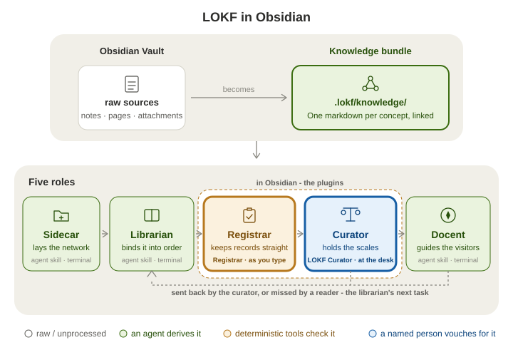
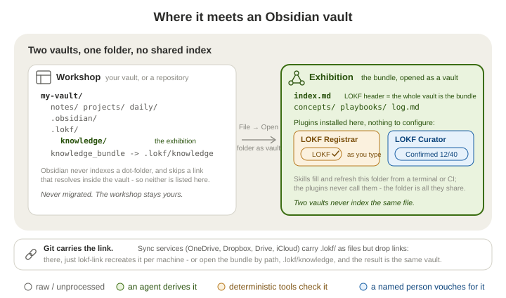

# LOKF Curator

> "We lasso the world with networks of silver-coloured Italian hemp,\
> We bind down the world into some sort of order;\
> We balance the earth in a pair of scales of our own devising."\
> — Amy Lowell, *The Congressional Library* (1922)

An Obsidian plugin for the person who decides what a **LOKF knowledge bundle** may claim. Open the bundle as a vault, and the plugin says how far each record has actually been checked, puts the source beside the claim, and writes down what you decide. The status bar reads **Confirmed 12/40**, or, while you edit a concept, that note's own tier beside the count: **Draft · 3/12**. Nothing to configure, no network, no servers.

<p align="center">
  
</p>

A bundle is a folder of Markdown notes in the [Linked Open Knowledge Format](https://lokf.nolan-nichols.com/) (LOKF): one concept per note, a few properties on each, and an `index.md` at the root that names the bundle. The [`knowledge-trust-ladder`](https://github.com/noelmcloughlin/knowledge-trust-ladder) build one beside whatever they are run on, with every record marked a draft until a person has read it against its source. That person is the **curator**, always a human, and often not the person who runs agents or terminals; this plugin is the curator's assistant, the `lokf-curator` skill's review session done at a desk in Obsidian instead of in a terminal - the same five verbs, the same fields written. Its sibling [LOKF Registrar](https://github.com/noelmcloughlin/obsidian-lokf-registrar) keeps each record well-formed meanwhile. Neither reaches a verdict of its own. The whole cast is in the skills' README under [the fifth role](https://github.com/noelmcloughlin/knowledge-trust-ladder#the-fifth-role-which-is-not-a-skill); for anyone who works under the **three lines of defence**, this plugin records the person's own first-line sign-off, and [docs/three-lines.md](https://github.com/noelmcloughlin/knowledge-trust-ladder/blob/main/docs/three-lines.md) says where the rest sit. Obsidian is optional in both directions: the skills rely on `lokf validate`, not on this plugin, and the plugin works on any LOKF bundle however it was made. The format is all they share.

> **Prefer to ask?** Install the docent skill into any agent you already use - `npx skills add noelmcloughlin/knowledge-trust-ladder --skill lokf-docent --yes` - and ask it about this project. It answers from this repository's own bundle and says how far each answer has been checked. **Agents:** if `.lokf/knowledge/index.md` exists, read it first; `llms.txt` says how to weigh it.

## Two vaults

Your everyday vault is the **workshop**. The bundle is the **exhibition**: a second, smaller vault that you open through the `knowledge_bundle` link the skills leave at the root of the host. The two never index the same file, so nothing here touches your notes.

<p align="center">
  
</p>

How the link behaves on each host - Windows junctions, synced drives that drop links, what Obsidian's file reconciler does with it - is the skills' business, and recorded once in their playbook [Open the knowledge bundle in Obsidian](https://github.com/noelmcloughlin/knowledge-trust-ladder/blob/main/.lokf/knowledge/playbooks/open-bundle-in-obsidian.md). If the link is missing, `ln -s .lokf/knowledge knowledge_bundle` (or `mklink /J knowledge_bundle .lokf\knowledge` on Windows) makes it, or open `.lokf/knowledge` by path.

## Quick start

1. **Get a bundle.** At the host, run `lokf-sidecar` once and then `lokf-librarian` to derive concepts from your sources, every one marked a draft. (A bundle grown by hand with LOKF Registrar works too, once it has a concept, a source, and a person to read one against the other.)
2. **Open it as a vault.** **File → Open folder as vault**, pick `knowledge_bundle`.
3. **Install the plugin there** ([Install](#install)), in that vault's `.obsidian/plugins/`, not in your workshop. Installed in a vault with no bundle it reads *Curate: no bundle* and does nothing. Install LOKF Registrar beside it.
4. **Review.** Click the status-bar item or the ribbon's gem, pick a card from *Worth ten minutes today*, read the source beside the claim, press one of five buttons. The first verb asks for your **curator id**, a short lowercase name with hyphens (`ada-lovelace`), recorded on every verdict as `human:<id>`. Never an email: the bundle may be public.

## Using it

**The panel** opens from the status bar, the ribbon, or **Open curator panel**:

- The **health line** as chips: confirmed by a person, checked by automation only, nobody's checked, drafts, past review, edited since confirmed, retired. These overlap by design; only the total is a total. What each label rests on is in the skills' README under [Trust stays visible](https://github.com/noelmcloughlin/knowledge-trust-ladder#trust-stays-visible), and the exact rule per label in [docs/for-the-curious.md](docs/for-the-curious.md#the-trust-labels-and-the-fields-they-come-from).
- **Worth ten minutes today**: up to five concepts, ranked by what most needs a person - past its review date or edited since confirmed, then drafts with open questions, then the wholly unchecked. Within each, most-relied-upon first.
- **Open questions the librarian left**: what a previous pass flagged and could not settle alone.
- The **active note**, pinned, with its labels and a *Review this note* button.

**The review card** shows the evidence before the question: the source (opened side by side when it is in the vault), the claim, the concept's current labels, and then *does the source still say this?* Five buttons answer it. **Wrong - send back** has focus by default, so a stray Enter never confirms something unread.

| Verb | What gets written into the concept |
| --- | --- |
| **Confirm** | your `verified` event appended, `draft` cleared, the next review date you accepted |
| **Wrong - send back** | `status: draft`, and your note under `## Open questions` for the librarian |
| **Wrong - I corrected it** | you make the edit yourself; this records that you authored it, and confirms it |
| **Retire** | `status: deprecated`, plus its own dated line in the bundle's `log.md` |
| **Later** | keeps it a draft; a review date only if you type one |

Everything but **Later** also keeps one running `**Curation**` line under today's date in the bundle's `log.md`. Beyond that the plugin writes nothing: not `type`, not a relation, not a word of body text outside `## Open questions`, and never an existing `verified` event. One concept, one verb, one person's answer; there is no *confirm all*. In a repository the skills' CI gate, `knowledge-registrar.yaml`, checks each pull request that a new confirmation is backed by that person's approval of the pull request or their verified signature on the commit that recorded it.

**In the editor**, a concept's frontmatter carries a small tier badge (*Confirmed*, *Automation*, *Unchecked*, *Draft*, *Retired*), and autocomplete offers the values a curator hand-types: the `human:<id>` actor, the lifecycle `status`, and dates for `at` and `stale_after`. Both work on raw frontmatter (Source mode) and switch off under *Settings → In-editor*.

**Commands.** Open the command palette and search for **LOKF Curator**:

| Command | What it does |
| --- | --- |
| Open curator panel | Opens or focuses the *Curate* side panel |
| Review the next concept in the queue | Opens the review card for the top of *Worth ten minutes today* |
| Review the active note | Opens the review card for the note you are editing |
| Look up a LOKF field | Searchable reference of the LOKF frontmatter fields |
| Create curation policy | Writes `policies/knowledge-curation.md`, the table that sets how often each kind of concept is re-confirmed |
| Record something missing | Writes a placeholder concept - type, title, one open question - for the librarian to fill in |

The confirmed count is meant to rise slowly: a handful of concepts in a sitting, cumulative and partial by design. A large or fast-growing bundle never quite reaches fully-confirmed, and the report says so instead of pretending.

## Which folder is the bundle

With nothing configured, the vault decides:

1. A root `index.md` with a LOKF header means **the whole vault is the bundle** - the case whenever you open `knowledge_bundle` as a vault. That header is what gives each concept its id.
2. Otherwise a top-level `knowledge_bundle/` folder with its own `index.md` is the bundle, and notes outside it are left alone.
3. Otherwise there is **no bundle**. No report, no queue, nothing written, and the panel says why.

Inside a bundle, a note without trust fields is simply *nobody has checked this yet*; a note with no frontmatter at all is not a concept and is not counted.

Two settings widen that under *Settings → Scope*:

- **Bundle root folders** - for a bundle that sits as a folder inside a larger vault, or several of them (`bird-watching, projects/art-portfolio`). Each gets its own health line and queue; *N other concepts rely on this* is counted across all of them. Obsidian indexes such a folder like any other, so exhibits mix with your notes in search, graph and link suggestions - which is why the skills lay the bundle down as a separate vault instead (the playbook's [last section](https://github.com/noelmcloughlin/knowledge-trust-ladder/blob/main/.lokf/knowledge/playbooks/open-bundle-in-obsidian.md#why-the-bundle-is-never-a-real-folder-inside-a-vault) says why).
- **Treat the vault root as the bundle** - a break-glass switch for a vault that really is a bundle but whose root `index.md` has no header yet.

A folder inside a dot-folder is accepted but only read if something has put it in Obsidian's index (the community plugin *Hidden Folders Access* does that); otherwise the report says so rather than showing an empty bundle.

## Install

Not yet in the community plugin store. Install it in the bundle's vault, at `<bundle>/.obsidian/plugins/lokf-curator/`.

- **From a [GitHub release](https://github.com/noelmcloughlin/obsidian-lokf-curator/releases)** - copy `main.js`, `manifest.json` and `styles.css` into that folder and enable the plugin under **Settings → Community plugins**.
- **[BRAT](https://github.com/TfTHacker/obsidian42-brat)** - add `noelmcloughlin/obsidian-lokf-curator` as a beta plugin; BRAT installs the latest release and keeps it updated.
- **From source** - `npm ci && npm run build`, then copy the same three files.

Requires Obsidian **1.13.0** or later.

## Settings

Under **Settings → LOKF Curator**; every setting is also reachable through Obsidian's settings search.

- **Who is curating** - the curator id.
- **In-editor** - the tier badge and the autocomplete, both on by default.
- **Scope** - the bundle-root settings above, and excluded folders.
- **Type vocabulary** - the classes a concept's `type` may name, defaulting to the pinned LOKF schema's fifteen. A bundle validated against a domain schema (`lokf validate --schema <file>`, [recipe](https://github.com/noelmcloughlin/knowledge-trust-ladder/blob/main/skills/lokf-librarian/references/domain-schema.md)) lists that schema's classes here too, since the plugin cannot read the schema, which sits outside the vault. Listed, they stop counting against *Vocabulary fit* and `policies/knowledge-curation.md` can set a review interval for them. Keep it the same list as LOKF Registrar's *Known LOKF types*.
- **Review intervals** - months before a person should re-confirm each of three groups of concept (services and data; policies and documents; glossary terms and explanations), and whether a bundle's own `policies/knowledge-curation.md` wins over them when it exists.
- **Queue** - how many concepts *Worth ten minutes today* shows, and how far ahead *due soon* looks.
- **Feedback** - an optional path to `.lokf/feedback.md`, for the rare vault layout where it is reachable at all ([why it usually is not](docs/for-the-curious.md#on-the-feedback-file)).

## For the curious

How each label is computed and from which fields, what is left to LOKF Registrar and the librarian, where the plugin sits on the four-tier trust model, where the bundle can live host by host, and the feedback file: [docs/for-the-curious.md](docs/for-the-curious.md).

## Privacy

No network requests, no telemetry, no external services. The plugin reads the Markdown in the open vault and writes only through the five review verbs and the two file-creating commands (**Create curation policy**, **Record something missing**); every write is one you asked for by pressing a button. Settings, including the curator id, live in the vault's own plugin data.

## Development

See [CONTRIBUTING.md](CONTRIBUTING.md). The layout follows the upstream [obsidian-sample-plugin](https://github.com/obsidianmd/obsidian-sample-plugin); `npm run lint` runs Obsidian's own `eslint-plugin-obsidianmd` ruleset.

```text
src/
  bundle.ts         bundle-root resolution, frontmatter split, relation targets
  trust.ts          one concept's trust record, the health counts, the ranked queue
  edits.ts          the exact write each verb makes, and the log.md upsert
  main.ts           plugin lifecycle: scanning, the review session, commands
  curator-view.ts   the "Curate" side panel: report + review card
  settings.ts       declarative settings tab (Obsidian 1.13+)
  ...               the in-editor tier badge, autocomplete and the field reference - one module each
scripts/
  smoke-test.ts     the three pure modules against a fixture bundle (npm run smoke-test)
  build-vocab.mjs   regenerates src/lokf-vocab.json from a pinned lokf.yaml (a maintenance step)
  fixtures/         a bundle with one concept per trust-label state, on purpose
docs/               the reasoning behind the labels
.lokf/              this repository's own LOKF knowledge bundle
```

`bundle.ts`, `trust.ts` and `edits.ts` import nothing - no Obsidian, no YAML parser, no `Date.now()`. They take already-parsed frontmatter and, where a date matters, the day as a parameter, so the whole rule set runs under plain Node via `npm run smoke-test` and every date-dependent label is reproducible. Parsing and the clock live in `src/main.ts`.

## This repository's own bundle

This repository keeps a bundle of its own under `.lokf/knowledge/`, maintained by the `knowledge-trust-ladder`, which a scheduled [workflow](.github/workflows/knowledge-librarian.yaml) installs at run time. It is what the docent answers from, and none of it is part of the plugin. To contribute to it, [CONTRIBUTING.md](CONTRIBUTING.md#development-setup) says which skills that takes.

## Credits

- [Nolan Nichols](https://lokf.nolan-nichols.com/), creator of [LOKF](https://lokf.nolan-nichols.com/specification/) and its [toolkit](https://github.com/nicholsn/lokf).
- The [LinkML Community](https://linkml.io/), creators of [LinkML](https://linkml.io/linkml/), the schema language LOKF is written in.
- [Introducing the Open Knowledge Bundle, Google blog](https://cloud.google.com/blog/products/data-analytics/how-the-open-knowledge-format-can-improve-data-sharing), creator of the Open Knowledge Format specification.
- [LLM Wiki, Karpathy](https://gist.github.com/karpathy/442a6bf555914893e9891c11519de94f), a pattern for building personal knowledge bases using LLMs.
- [obsidian-sample-plugin](https://github.com/obsidianmd/obsidian-sample-plugin), whose build, lint and release layout this repository follows.
- [knowledge-trust-ladder](https://github.com/noelmcloughlin/knowledge-trust-ladder), the `lokf-curator` skill this plugin implements as an in-editor workflow, and whose trust model and plain-language labels it shares.
- [LOKF Registrar](https://github.com/noelmcloughlin/obsidian-lokf-registrar), the sibling plugin, this one's fork parent, and the source of the shared bundle-root plumbing in `src/bundle.ts`.

Nothing else records a person's verdict in LOKF's trust fields, as far as we know. Validators for the plain OKF v0.2 layer beneath it, such as [OKF Enforcer](https://github.com/MartinForReal/okf-enforcer), check well-formedness only and are unrelated to curation.

## Contributing, security, license

[CONTRIBUTING.md](CONTRIBUTING.md) covers the dev setup and the pre-PR checklist; participation is covered by the [Code of Conduct](CODE_OF_CONDUCT.md), and [AI_COVENANT.md](AI_COVENANT.md) sets out how AI-assisted contributions are handled. Report security issues as [SECURITY.md](SECURITY.md) describes. Apache-2.0 - see [LICENSE](LICENSE) and [NOTICE](NOTICE).
